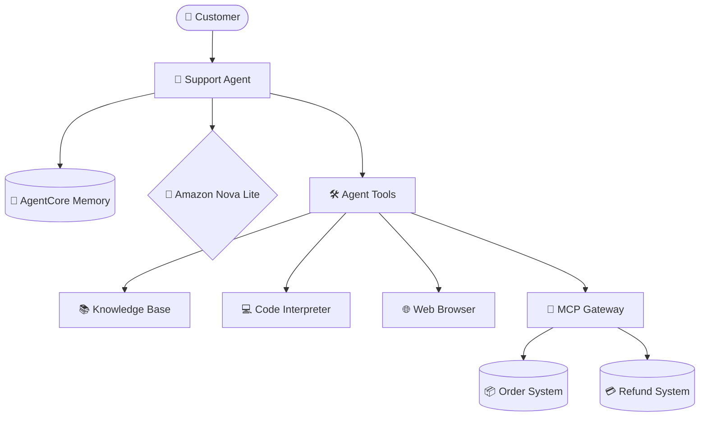

<div align="center">
  
  <h1>Customer Support AI Agent</h1>
  <p><i>Powered by Amazon Bedrock, AgentCore, and the Strands SDK</i></p>

  <p>
    
    
    
    
  </p>
</div>

---

## 📖 Overview

The **Customer Support AI Agent** is an advanced, generative AI-powered chatbot designed for an e-commerce platform. It leverages the latest **Amazon Nova Lite** model via **Amazon Bedrock** to provide empathetic, accurate, and context-aware customer support. 

Built using the **Strands SDK**, this agent seamlessly integrates multiple powerful tools to handle everything from real-time order tracking and refund processing to complex loyalty program calculations and long-term customer memory.

---

## ✨ Key Features

- 🧠 **Context-Aware Memory**: Utilizes **AgentCore Memory** to remember user preferences and past interactions across sessions.
- 📦 **Order Management**: Connects via **MCP Gateway** to securely track order statuses and process returns/refunds.
- 📚 **Knowledge Base Retrieval**: Uses Amazon Bedrock RAG (Retrieval-Augmented Generation) to instantly fetch product specs, return policies, and loyalty program details.
- 💻 **Secure Code Interpreter**: Safely calculates exact loyalty point redemptions and tier-based discounts in a sandboxed environment.
- 🌐 **Web Browsing**: Dynamically fetches live information from public URLs to assist customers with up-to-date answers.

---

## 🏗️ Architecture



---

## 🚀 Installation & Usage

### 1. Environment Setup
Install the necessary dependencies using `uv`:
```bash
uv sync
```

### 2. AWS Credentials
Export your temporary AWS credentials and configure your environment:
```bash
source setup.sh
```

### 3. Running the Agent Locally
You can test the agent locally using the provided test runner script:
```bash
bash run_tests.sh
```
Or run individual prompts via the CLI:
```bash
uv run main.py '{"prompt": "Can you track order ORD-001?", "customer_id": "CUST-123", "session_id": "t1"}'
```

---

## 📸 Demonstration

The agent successfully handles complex, multi-step tasks. Here are some key interactions:

- **Order Tracking & Refund Processing**: Securely verifies customer details before accessing the order system via the MCP Gateway.
- **Loyalty Discount Calculation**: Uses the Code Interpreter to dynamically compute points redemption and applies tier discounts with mathematical precision.
- **Long-Term Memory**: Retains customer preferences (like requesting "concise responses") and applies them to future interactions.
*(See `screenshots/` directory for full execution logs).*

---

<div align="center">
  <p><i>Built for the Udacity AWS Bedrock AgentCore Project</i></p>
</div>
